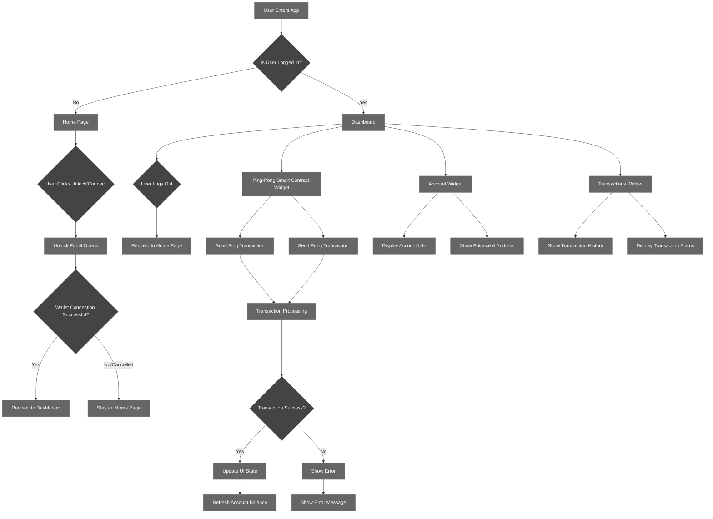
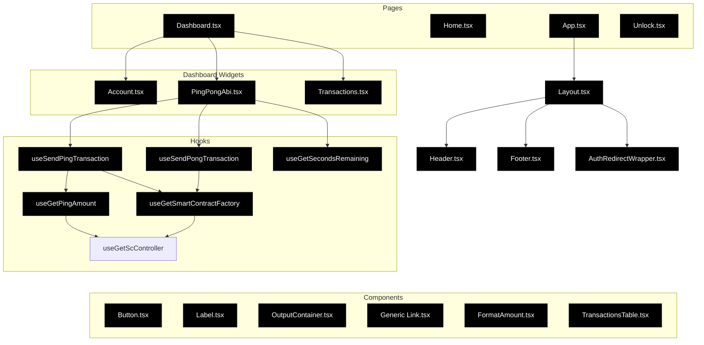

# Building a React dApp from scratch with @multiversx/sdk-dapp

Welcome to the MultiversX sdk-dapp v5 tutorial! 🚀

#### Overview

This tutorial will guide you through the process of building a dApp from scratch with React, Tailwind, @multiversx/sdk-core and @multiversx/sdk-dapp.

You can find the video tutorials on the [MultiversX YouTube channel](https://www.youtube.com/watch?v=dQw4w9WgXcQ).

You can find the documentation for the sdk-dapp v5 in the [MultiversX sdk-dapp v5 documentation](https://github.com/multiversx/mx-sdk-dapp).

#### How to use this tutorial

Either follow along with the video tutorials or go to a specific section either by checking out a specific git commit or by running the setup scripts.

Example: Running the setup scripts for the first section
```bash
cd ./mx-tutorial-sdk-dapp-v5/tutorial/01_create_react_app && bash run_project_setup.sh
```

This will run all the setup scripts for all the sections.
```bash
cd ./mx-tutorial-sdk-dapp-v5/tutorial && bash run_all.sh
```

## Main sections

1. Creating a new React project with Vite
2. Preparing the basic App structure with routing
3. Installing sdk-dapp & its dependencies
4. Creating the Dashboard with Widgets
5. Creating Header, Footer and Layout components
6. Connecting and Testing the dApp functionality

## Section 1: Creating a new React project with Vite

1. Create a new Vite React project (TypeScript template)
2. Install dependencies
3. Install Tailwind CSS and its dependencies
4. Add tailwind.config.js configuration
5. Add postcss.config.js configuration
6. Replace contents of src/index.css with Tailwind directives
7. Copy the multiversx-white.svg file to the public folder
8. Configure eslint and prettier
9. Configure .prettierrc file
10. Configure eslint.config.js file
11. Install Vite configuration dependencies
12. Configure vite.config.ts (globals and https)
13. Configure tsconfig.json (absolute imports)
14. Add formatting scripts to package.json
15. Run lint to fix errors
16. Check if the project is running

## Section 2: Preparing the basic App structure with routing

1. Install react-router-dom
2. Create pages folder and Home page component
3. Create routes folder under /src
4. Create routes configuration files (index.ts, routes.ts)
5. Create Layout component
6. Update App.tsx file with routing configuration
7. Run lint to fix errors

## Section 3: Installing sdk-dapp

1. Install MultiversX SDK packages (@multiversx/sdk-dapp and related dependencies)

## Section 4: Creating the Dashboard with Widgets

1. Create configs for the dApp (config.devnet.ts, contract address)
2. Create the dashboard folder structure
3. Install FontAwesome and classnames dependencies
4. Create helper components (Button, Label, OutputContainer)
5. Create the Account widget component
6. Create the PingPong widget component
7. Create widgets index file for exports
8. Create the Dashboard page component
9. Export the Dashboard page from pages
10. Update the routes configuration with Dashboard
11. Run lint to fix errors

## Section 5: Creating Header, Footer and Layout components

1. Create generic link component
2. Create Unlock page component
3. Create Header component with navigation
4. Create Footer component
5. Update Layout component to use Header and Footer
6. Create Transactions widget component
7. Update Dashboard page to include Transactions widget
8. Run lint to fix errors

## Section 6: Interacting with the Smart Contract

1. Initialize SDK in main.tsx with dApp configuration
2. Update Unlock component and Header navigation with sdk-dapp hooks
3. Create FormatAmount component for account widget
4. Create TransactionsTable and update Transactions widget
5. Create PingPong widget with contract ABI and functionality
6. Create AuthenticatedRoutesWrapper component for route protection

## User Flow:



## Component structure


